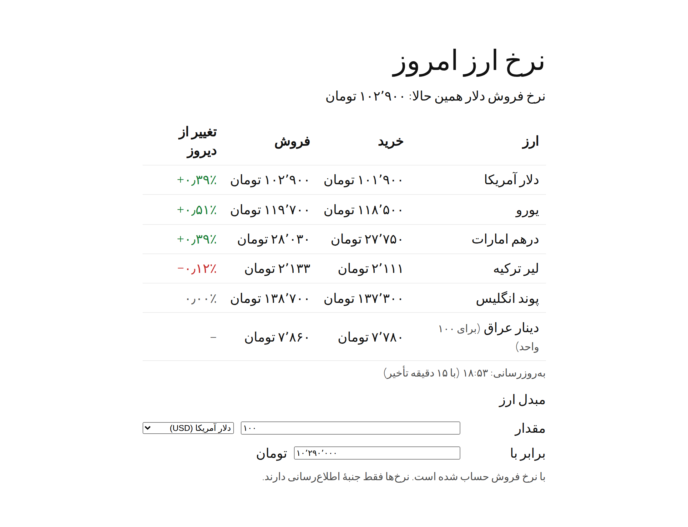
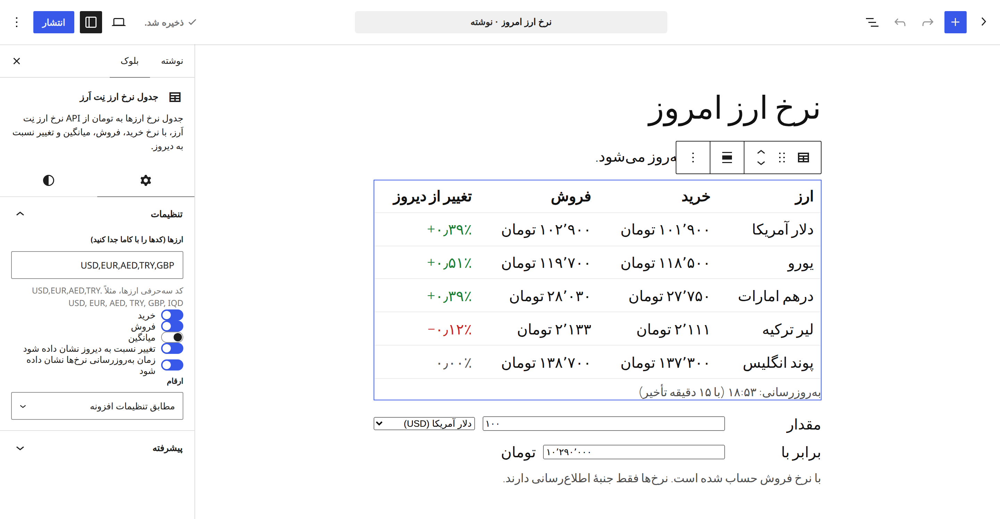

<div align="center">

# افزونهٔ وردپرس نرخ ارز نِت اَرز (NetArz FX Rates)

**نرخ دلار و ارزهای دیگر به تومان در سایت وردپرسی، با کد کوتاه، بلوک، مبدل ارز یا ابزارک.**

WordPress plugin for Iranian Toman exchange rates (USD, EUR, AED, TRY and more) via the NetArz FX API: shortcodes, blocks, a converter, a widget, cache, Persian translation.

[](https://github.com/netarz/netarz-fx-wordpress/actions/workflows/ci.yml)
[](LICENSE)
[](https://github.com/netarz/netarz-fx-wordpress/releases)
[](readme.txt)
[](netarz-fx.php)
[](https://netarz.ir/docs/fx?utm_source=github&utm_medium=referral&utm_campaign=netarz-fx-wordpress&utm_content=header)

[دانلود آخرین نسخه](https://github.com/netarz/netarz-fx-wordpress/releases/latest) · [ساخت کلید رایگان](https://netarz.ir/fx?utm_source=github&utm_medium=referral&utm_campaign=netarz-fx-wordpress&utm_content=header) · [معرفی API نرخ ارز](https://netarz.ir/fx-api?utm_source=github&utm_medium=referral&utm_campaign=netarz-fx-wordpress&utm_content=header) · [تابلوی نرخ ارز](https://netarz.ir/rates?utm_source=github&utm_medium=referral&utm_campaign=netarz-fx-wordpress&utm_content=header) · [English](#english)

</div>

<a id="intro"></a>

افزونه‌ای کوچک برای نمایش **نرخ دلار، یورو، درهم، لیر و ارزهای دیگر به تومان** در سایت وردپرسی، با کد کوتاه
(شورت‌کد)، بلوک ویرایشگر، مبدل ارز یا ابزارک. نرخ‌ها از [API نرخ ارز نِت اَرز](https://netarz.ir/fx-api?utm_source=github&utm_medium=referral&utm_campaign=netarz-fx-wordpress&utm_content=intro) می‌آیند و همان اعداد
[تابلوی نرخ ارز](https://netarz.ir/rates?utm_source=github&utm_medium=referral&utm_campaign=netarz-fx-wordpress&utm_content=intro) هستند.

```text
[netarz_rate currency="usd"]                               نرخ فروش دلار، داخل متن
[netarz_rate currency="eur" field="buy" show_name="1"]     نرخ خرید یورو با نام ارز
[netarz_rates currencies="usd,eur,aed,try"]                جدول خرید و فروش چند ارز
[netarz_rates currencies="usd,eur" change="1" updated="1"] همراه تغییر از دیروز و زمان به‌روزرسانی
[netarz_convert currencies="usd,eur,aed,try"]              مبدل تومان و ارز، در هر دو جهت
```

در ویرایشگر بلوک، «ارز» را جستجو کنید: سه بلوک «نرخ ارز نِت اَرز»، «جدول نرخ ارز نِت اَرز» و «مبدل ارز نِت اَرز» با
پیش‌نمایش زنده آماده‌اند. ابزارک «نرخ ارز نِت اَرز» هم همان جدول را در ستون کناری نشان می‌دهد.

<p align="center">
  
</p>

## فهرست

- [نصب در چهار قدم](#install)
- [از سرور یا از مرورگر؟](#modes)
- [بلوک‌ها، جدول و مبدل ارز](#blocks)
- [افزونه چه می‌کند](#features)
- [ووکامرس](#woocommerce)
- [لینک منبع](#credit)
- [طرح رایگان کافی است؟](#plans)
- [خطاهای رایج](#errors)
- [مخزن‌های دیگر نِت اَرز](#related)
- [مشارکت و پشتیبانی](#support)
- [English](#english)

<a id="install"></a>

## نصب در چهار قدم

1. فایل `netarz-fx-1.1.0.zip` را از [صفحهٔ نسخه‌ها (Releases)](https://github.com/netarz/netarz-fx-wordpress/releases/latest) دانلود کنید و از
   «افزونه‌ها ← افزودن ← بارگذاری افزونه» نصب و فعال کنید. دکمهٔ سبز «Code ← Download ZIP» هم کار می‌کند، ولی پوشهٔ افزونه
   نام دیگری می‌گیرد؛ فایل Releases پوشهٔ درست `netarz-fx` را دارد.
2. در [پنل API نرخ ارز](https://netarz.ir/fx?utm_source=github&utm_medium=referral&utm_campaign=netarz-fx-wordpress&utm_content=install) یک اپ با دامنهٔ سایتتان بسازید و کلید `fx-ntz-v1-…` را کپی کنید.
   کلید را فقط همان یک بار می‌بینید.
3. مالکیت دامنه را در همان پنل تأیید کنید. فایل آماده را دانلود کنید و بدون ویرایش در پوشهٔ `.well-known` بگذارید، یا رکورد TXT بسازید.
4. در وردپرس به «تنظیمات ← نرخ ارز نِت اَرز» بروید (در وردپرس انگلیسی: Settings ← NetArz FX)، کلید را بگذارید و ذخیره کنید، بعد «آزمایش اتصال» را بزنید.

حالا در هر نوشته یا برگه بنویسید `[netarz_rate currency="usd"]`، یا در ویرایشگر یکی از بلوک‌های نِت اَرز را اضافه کنید.

<a id="modes"></a>

## از سرور یا از مرورگر؟

| حالت | کی مناسب است | چه لازم دارد |
|---|---|---|
| **از همین سرور** (پیش‌فرض، پیشنهادی) | هاست یا سروری که IP خروجی ثابت دارد | IP خروجی سرور در «IPهای مجاز» اپ |
| **از مرورگر بازدیدکننده** | هاستی که IP ثابت ندارد | فقط دامنهٔ تأییدشده. کلید در سورس صفحه دیده می‌شود ولی روی دامنهٔ دیگری کار نمی‌کند؛ هر بازدیدکننده بخشی از سهمیهٔ روزانهٔ اپ را مصرف می‌کند |

اگر نمی‌دانید IP خروجی سرورتان چیست، «آزمایش اتصال» را بزنید. اگر نِت اَرز درخواست را نپذیرد، افزونه **همان IPی را که نِت اَرز دیده**
نشان می‌دهد؛ دقیقاً همان را در پنل اضافه کنید. IP دامنه (مثلاً IP کلادفلر) ملاک نیست.
گزینهٔ «اتصال با IPv4» به‌طور پیش‌فرض روشن است، چون `netarz.ir` آدرس IPv6 هم دارد و سرور دوپشته‌ای (IPv4 و IPv6)
ممکن است با IPv6 وصل شود. توضیح کامل: [راهنمای قفل دامنه و IP](https://github.com/netarz/fx-api-examples/blob/main/guides/domain-and-ip-allow-list.md)

<a id="blocks"></a>

## بلوک‌ها، جدول و مبدل ارز

| بلوک | کد کوتاه هم‌ارز | تنظیم‌ها |
|---|---|---|
| نرخ ارز نِت اَرز | `[netarz_rate]` | ارز، نرخ خرید یا فروش یا میانگین، نام ارز، ارقام |
| جدول نرخ ارز نِت اَرز | `[netarz_rates]` | ارزها، ستون‌های خرید و فروش و میانگین، تغییر از دیروز، زمان به‌روزرسانی، ارقام |
| مبدل ارز نِت اَرز | `[netarz_convert]` | ارزها، نرخی که با آن حساب می‌شود، مقدار اولیه، زمان به‌روزرسانی، ارقام |

<p align="center">
  
</p>

- **تغییر از دیروز** (`change="1"`): درصد تغییر نسبت به بستهٔ دیروز، سبز برای افزایش و قرمز برای کاهش.
- **زمان به‌روزرسانی** (`updated="1"`): مثلاً «به‌روزرسانی: ۱۴:۲۰». در طرح رایگان، تأخیر نرخ هم کنارش نوشته می‌شود.
- **مبدل ارز:** بازدیدکننده مقدار ارز یا مقدار تومان را می‌نویسد و خانهٔ دیگر هم‌زمان حساب می‌شود؛ ارقام فارسی هم پذیرفته می‌شود.
  نرخ‌ها همراه صفحه می‌آیند، پس تایپ کردن درخواستی به API نمی‌فرستد.
- **ارقام:** `digits="persian"` یا `digits="latin"` روی هر کد کوتاه، تنظیم کلی افزونه را فقط برای همان‌جا عوض می‌کند.
- **ارزهای ویژهٔ پرو:** ارزی که فقط در طرح پرو ارائه می‌شود (مثل سوم ازبکستان، `UZS`) در طرح رایگان برای بازدیدکننده
  «نرخ در دسترس نیست» نشان داده می‌شود و مدیر سایت یک یادداشت کوتاه دربارهٔ طرح پرو می‌بیند.

<a id="features"></a>

## افزونه چه می‌کند

- **یک درخواست در هر دورهٔ کش.** کل تابلوی نرخ یک بار گرفته می‌شود و همهٔ شورت‌کدها و ابزارک‌ها از همان نسخه می‌خوانند.
  زمان کش را خودتان تعیین می‌کنید (۱ تا ۶۰ دقیقه، پیش‌فرض ۵).
- **آخرین نرخ سالم را نگه می‌دارد.** اگر API در دسترس نباشد، بازدیدکننده آخرین نرخ گرفته‌شده را می‌بیند، نه جای خالی.
- **ارقام فارسی یا لاتین**، به‌طور پیش‌فرض مطابق زبان سایت.
- **بدون مرحلهٔ build:** بلوک‌ها با `block.json` و یک فایل JavaScript ساده ساخته شده‌اند؛ برای توسعه به npm نیاز ندارید.
- ترجمهٔ فارسی همراه افزونه است (text domain: `netarz-fx`) و هر مقداری که چاپ می‌شود escape شده است.

<a id="woocommerce"></a>

## ووکامرس

اگر قیمت محصولات فروشگاهتان به ارز خارجی (مثلاً دلار) است، در «تنظیمات ← نرخ ارز نِت اَرز» گزینهٔ ووکامرس را روشن کنید تا
کنار هر قیمت «حدود … تومان» بیاید. این گزینه به‌طور پیش‌فرض خاموش است، فقط در حالت «از همین سرور» کار می‌کند و از
نرخ‌های کش‌شده استفاده می‌کند، پس برای هر محصول درخواست تازه‌ای نمی‌فرستد. محصول متغیر (variable) یک قیمت ندارد؛
معادل تومانی برای هر گونهٔ آن جدا نشان داده می‌شود.

<a id="credit"></a>

## لینک منبع

لینک کوچک «نرخ از نِت اَرز» به صفحهٔ [نرخ ارز](https://netarz.ir/rates?utm_source=github&utm_medium=referral&utm_campaign=netarz-fx-wordpress&utm_content=credit) به‌طور پیش‌فرض **خاموش** است.
اگر خواستید به خوانندگان بگویید اعداد از کجا می‌آیند، از «تنظیمات ← نرخ ارز نِت اَرز» روشنش کنید؛ یک بار در هر صفحه زیر نرخ‌ها می‌آید.
با کد هم می‌شود آن را خاموش نگه داشت:

```php
add_filter( 'netarz_fx_show_attribution', '__return_false' );
```

<a id="plans"></a>

## طرح رایگان کافی است؟

برای بیشتر سایت‌ها بله. طرح رایگان فقط عضویت می‌خواهد و نرخ را با کمی تأخیر می‌دهد؛ با کش افزونه، هر سایت در حالت
سرور بخش کوچکی از سهمیهٔ روزانه را مصرف می‌کند. نرخ زنده و تاریخچه در طرح پرو است. اعداد دقیق:
[netarz.ir/docs/fx/plans](https://netarz.ir/docs/fx/plans?utm_source=github&utm_medium=referral&utm_campaign=netarz-fx-wordpress&utm_content=plans)

<a id="errors"></a>

## خطاهای رایج

| پیام | راه‌حل |
|---|---|
| `domain_not_verified` | تأیید دامنه را در پنل /fx کامل کنید |
| `origin_required` یا `ip_not_allowed` | IPی را که «آزمایش اتصال» نشان می‌دهد در «IPهای مجاز» اپ بگذارید، یا حالت مرورگر را انتخاب کنید |
| `origin_not_allowed` (در حالت مرورگر) | دامنهٔ سایت را به دامنه‌های اپ اضافه کنید (مثلاً اگر سایت روی www است) |
| «نرخ در دسترس نیست» | کلید وارد نشده، یا هنوز هیچ نرخی گرفته نشده؛ «آزمایش اتصال» علت را می‌گوید |
| «نرخ در دسترس نیست» فقط برای یک ارز | کد ارز را بررسی کنید. اگر با حساب مدیر وارد شده باشید و ارز فقط در طرح پرو باشد، یادداشتی زیر آن همین را می‌گوید |

<a id="related"></a>

## مخزن‌های دیگر نِت اَرز

| مخزن | چیست |
|---|---|
| [fx-api-examples](https://github.com/netarz/fx-api-examples) | نمونه‌کد همین API برای PHP، JavaScript، Python، Laravel، Google Sheets و Excel، و [راهنمای قفل دامنه و IP](https://github.com/netarz/fx-api-examples/blob/main/guides/domain-and-ip-allow-list.md) |
| [ai-api-examples](https://github.com/netarz/ai-api-examples) | نمونه‌کد وب‌سرویس هوش مصنوعی: GPT، Claude، Gemini و DeepSeek با یک کلید سازگار با OpenAI |
| [gisoo](https://github.com/netarz/gisoo) | **گیسو**، برند هوش مصنوعی نِت اَرز: اپ فارسی برای گفت‌وگو با بیش از ۴۰۰ مدل، ساخت تصویر، ویدیو، موسیقی و صدا، کارشناس‌های هوش مصنوعی و گفت‌وگوی صوتی، و وب‌سرویس سازگار با OpenAI و Anthropic (Claude Code) ([gisoo.pro](https://gisoo.pro/?utm_source=github&utm_medium=referral&utm_campaign=netarz-fx-wordpress&utm_content=related)) |
| [netarz](https://github.com/netarz/netarz) | معرفی همهٔ وب‌سرویس‌ها و مخزن‌های نِت اَرز |

همهٔ پروژه‌های متن‌باز ما یک‌جا: [netarz.ir/open-source](https://netarz.ir/open-source?utm_source=github&utm_medium=referral&utm_campaign=netarz-fx-wordpress&utm_content=related) · همهٔ مستندات فنی: [netarz.ir/docs](https://netarz.ir/docs?utm_source=github&utm_medium=referral&utm_campaign=netarz-fx-wordpress&utm_content=related)

<a id="support"></a>

## مشارکت و پشتیبانی

- **اشکال در افزونه:** یک [Issue](https://github.com/netarz/netarz-fx-wordpress/issues/new/choose) باز کنید و نتیجهٔ «آزمایش اتصال» را هم بگذارید.
- **رفع اشکال، ترجمه یا امکان تازه:** Pull Request بفرستید. پیش از آن [راهنمای مشارکت](CONTRIBUTING.md) را ببینید.
  CI هر تغییر را روی PHP 7.4 تا 8.4 بررسی می‌کند و `./build.sh` فایل ZIP افزونه را می‌سازد. فهرست تغییرات هر نسخه: [CHANGELOG.md](CHANGELOG.md)
- **حساب، اپ و کلید:** از پنل نِت اَرز تیکت بزنید یا به `info@netarz.ir` ایمیل بفرستید.
- **مشکل امنیتی:** در Issue عمومی ننویسید؛ طبق [سیاست امنیتی](SECURITY.md) به `dev@netarz.ir` بفرستید.

مجوز: GPL-2.0-or-later ([LICENSE](LICENSE)) · [آیین رفتار](CODE_OF_CONDUCT.md)

---

<a id="english"></a>

## English

**NetArz FX Rates** is a small WordPress plugin that shows exchange rates in Iranian Toman (USD, EUR, AED, TRY and more)
from the [NetArz FX API](https://netarz.ir/fx-api?utm_source=github&utm_medium=referral&utm_campaign=netarz-fx-wordpress&utm_content=english).

```text
[netarz_rate currency="usd"]                            dollar sell rate, inline
[netarz_rate currency="eur" field="buy" show_name="1"]  euro buy rate with its name
[netarz_rates currencies="usd,eur,aed,try"]             buy/sell table
[netarz_rates currencies="usd,eur" change="1" updated="1"]  plus change since yesterday and update time
[netarz_convert currencies="usd,eur,aed,try"]           Toman <-> currency converter, both ways
```

- Three blocks with a live preview: "NetArz exchange rate", "NetArz rates table" and "NetArz currency converter"
  (search for "NetArz" in the inserter). No build step: `block.json` plus a plain script on the `wp.*` globals.
- A classic widget with the same table, optionally with the change column and the updated line.
- `digits="persian"` or `digits="latin"` on any shortcode overrides the site-wide setting.
- The converter carries the cached rates with the page, so typing makes no API request; Persian digits are accepted.
- Pro-only currencies (for example `UZS`) show "Rate unavailable" to visitors on the free plan and a short note to administrators.
- Optional WooCommerce line: "about ... Toman" after prices in a foreign-currency store (off by default, server mode only).
- Settings > NetArz FX: API key, server or browser mode, cache minutes (default 5), Persian/Latin digits,
  WooCommerce, an optional "Rates by NetArz" credit link (off by default; turn it on in settings, or filter it with `netarz_fx_show_attribution`),
  and "Connect over IPv4".
- One API request per cache period for the whole site; the last good board is kept as a fallback.
- "Test connection" calls `/me` and, when the API refuses the server, prints the exact IP NetArz saw.
- Server mode sends no Origin/Referer: calls are matched by the server's IP. Browser mode relies on the domain lock.
- Translation-ready (`netarz-fx`), Persian translation included; all output escaped; `uninstall.php` removes its options.

**Install:** download `netarz-fx-1.1.0.zip` from [Releases](https://github.com/netarz/netarz-fx-wordpress/releases/latest),
upload it under Plugins > Add New > Upload Plugin, create an app and key at [netarz.ir/fx](https://netarz.ir/fx?utm_source=github&utm_medium=referral&utm_campaign=netarz-fx-wordpress&utm_content=english), verify the domain,
paste the key in Settings > NetArz FX and click "Test connection".

Links: [FX API docs](https://netarz.ir/docs/fx?utm_source=github&utm_medium=referral&utm_campaign=netarz-fx-wordpress&utm_content=english) · [Plans and limits](https://netarz.ir/docs/fx/plans?utm_source=github&utm_medium=referral&utm_campaign=netarz-fx-wordpress&utm_content=english) ·
[All NetArz open-source projects](https://netarz.ir/open-source?utm_source=github&utm_medium=referral&utm_campaign=netarz-fx-wordpress&utm_content=english) · Related: [fx-api-examples](https://github.com/netarz/fx-api-examples) ·
[ai-api-examples](https://github.com/netarz/ai-api-examples) · [gisoo](https://github.com/netarz/gisoo) (Gisoo, our Persian AI app and API, [gisoo.pro](https://gisoo.pro/?utm_source=github&utm_medium=referral&utm_campaign=netarz-fx-wordpress&utm_content=english))

Contributions are welcome: see [CONTRIBUTING.md](CONTRIBUTING.md). CI lints every change on PHP 7.4 to 8.4 and
`./build.sh` builds the plugin ZIP; changes per version are in [CHANGELOG.md](CHANGELOG.md). Report security issues privately to `dev@netarz.ir`
([SECURITY.md](SECURITY.md)). License: GPL-2.0-or-later.
